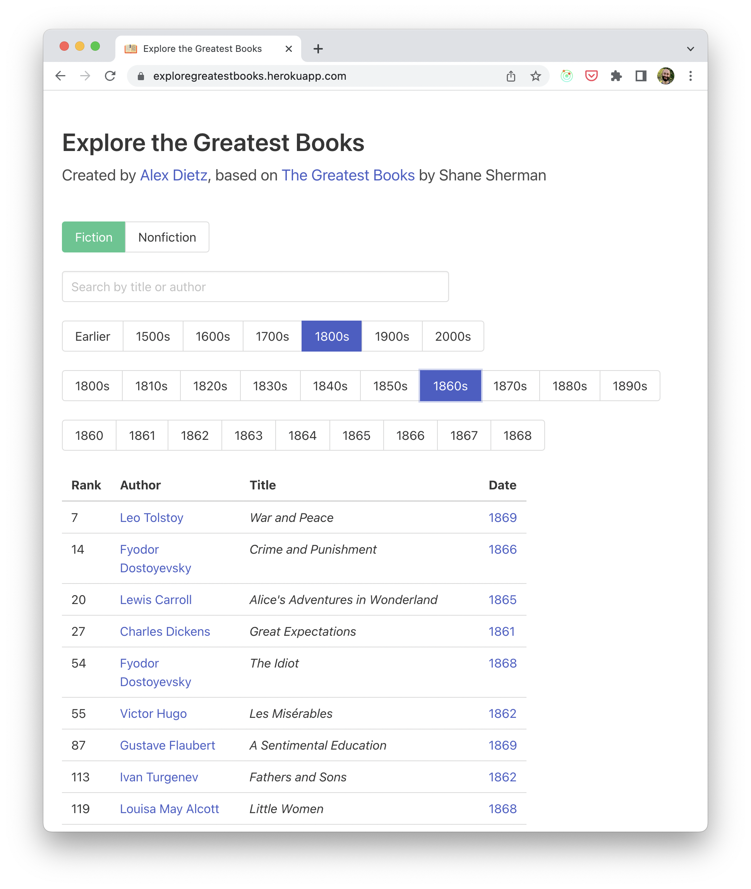
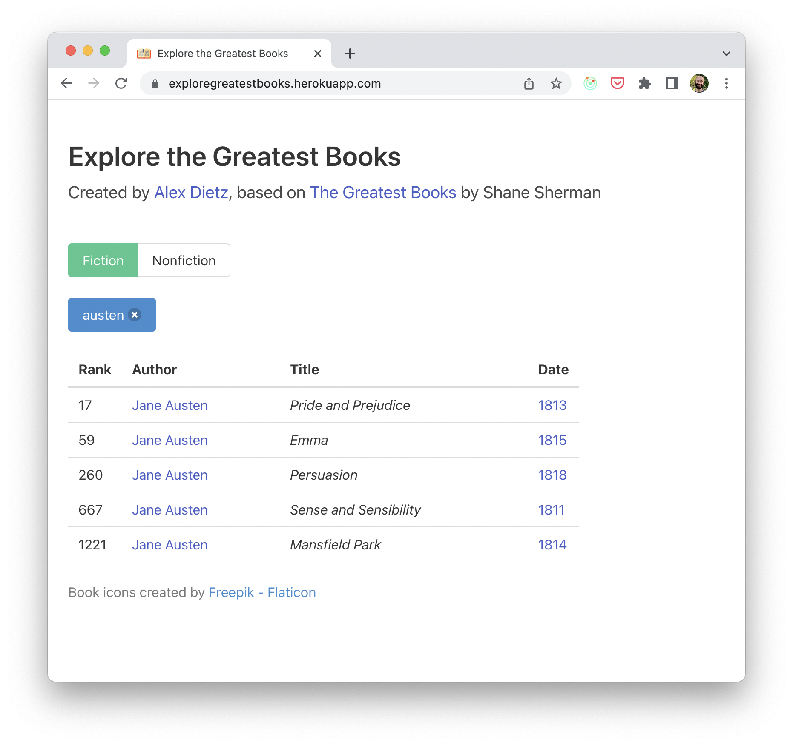

# Description
An app where users can explore the [great books lists](https://thegreatestbooks.org) created by Shane Sherman. Users can filter books by genre or date, and search by title or author.

The website is built using React, Redux, and TypeScript, and styled using Bulma.

# Screenshots

