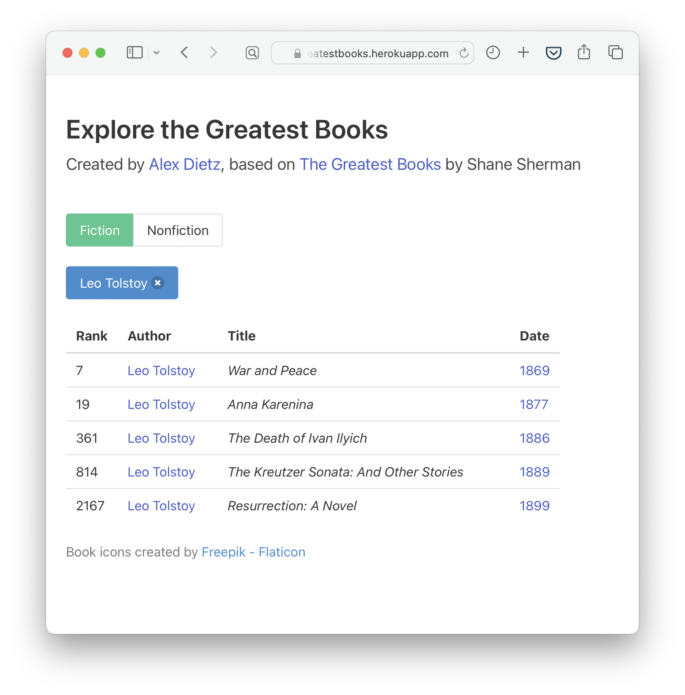

# Description
Explore the Greatest Books is a website where users can explore the [great books lists](https://thegreatestbooks.org) created by Shane Sherman. Users can filter books by genre, date, and author.

The website is built using React, Redux, and TypeScript, and styled using Bulma.

# Screenshots

